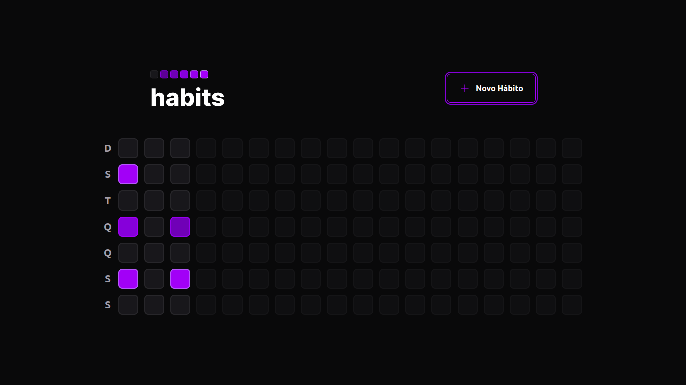
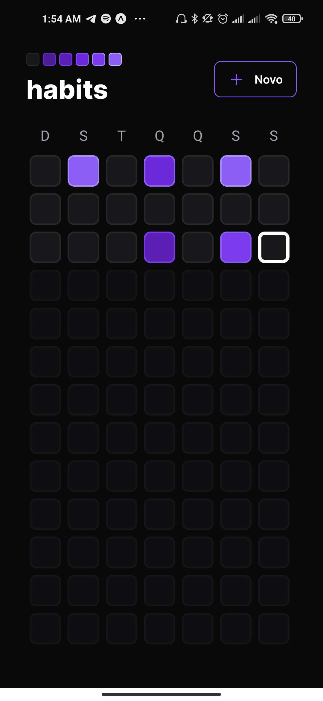
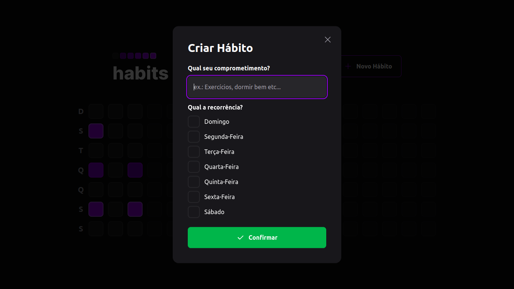
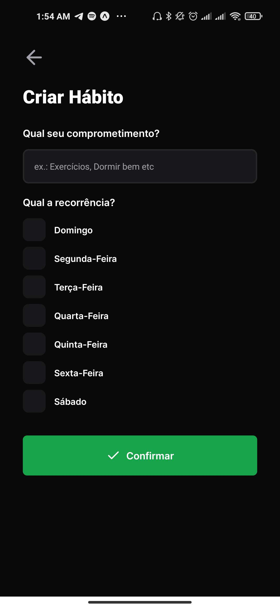

# habits-tracker
Projeto FullStack criado na 11º edição da Rocketseat NLW. Uma aplicação voltada a ajudar usuário a criar e monitorar novos hábitos que desejam seguir em suas rotinas. Foram desenvlvidas as versões web e mobile da aplicação durante o NLW Setup da Rocketseat.
```
Além do projeto original desenvolvido durante o evento, estou personalizando um pouco adicionando autenticação e notificações push.
```


##Tecnologias

<ul>
    <li><a href="https://reactjs.org/"> React</a></li>
    <li><a href="https://reactnative.dev/"> React Native</a></li>
    <li><a href="https://www.typescriptlang.org/"> Typescript</a></li>
    <li><a href="https://zod.dev/"> zod</a></li>
    <li><a href="https://www.prisma.io/">Prisma</a></li>
    <li><a href="https://www.radix-ui.com/">Radix</a></li>
    <li><a href="https://tailwindcss.com/">tailwindcss</a></li>
</ul>


##Visão do Projeto

<section class="container">
    <h3>Página Inicial</h3>
    <div class="screen">
        
        
    </div>
    <h3>Criar Novo Hábito</h3>
    <div class="screen">
        
        
    </div> 
</section>


<style>
    
    ul {
        list-style-type: none;       
    }

    li {
        margin-left: -24px;
    }

    li img {
        width: 20px;
    }

    li a {
        text-decoration: none !important;
        color:  !important;
    }

    li, li a {
        display: flex;
        justify-content: start;
        align-items: center;
        gap: 10px;
    }

    section.container {
        display: flex;  
        flex-direction: column;
        justify-content: center;
        align-items: center;
    }

    div.screen {
       display: flex;
       flex-direction: row;
       gap: 4px;
    }    

    img {
        display: block;
        max-width:1024px;
        max-height:240px;
        width: auto;
        height: auto;
    }
</style>